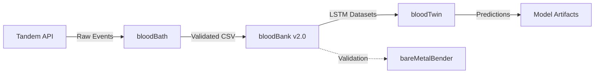

# 🩸 bloodBender Comprehensive System Context

**Generated:** February 13, 2026  
**Branch:** cleanup/deprecated-modules-and-nix-migration  
**Purpose:** Complete system overview for LLM context and team onboarding

---

## 🎯 Project Mission

bloodBender is an advanced data pipeline and machine learning system for diabetes management, processing Tandem insulin pump data to enable predictive glucose modeling. The system consists of three tightly integrated modules working in concert to transform raw pump data into actionable predictions.

---

## 🏗️ System Architecture

### Module Overview

```
bloodBender
├── bloodBath          ← Data synchronization & processing (Python)
├── bloodTwin          ← LSTM ML prediction model (PyTorch)
└── bareMetalBender    ← Glucose dynamics solver (C++)
```

---

## 🔄 Data Flow Pipeline

### End-to-End Process



### Detailed Flow

```
1. DATA ACQUISITION (bloodBath/api/)
   ├─ connector.py: Authenticate to Tandem t:connect API
   ├─ fetcher.py: Retrieve pump events with retry logic
   └─ Output: Raw JSON pump events

2. DATA EXTRACTION (bloodBath/data/)
   ├─ extractors.py: Parse and categorize events (CGM, basal, bolus)
   ├─ validators.py: Quality checks and range validation
   ├─ processors.py: Resample to 5-minute intervals
   └─ Output: Normalized event streams

3. DATA STORAGE (bloodBath/bloodBank/)
   ├─ raw/: Per-pump CSV files with metadata headers
   ├─ merged/: Combined multi-pump datasets
   ├─ lstm_pump_data/: ML-ready train/val/test splits
   └─ metadata/: Sync status and validation reports

4. ML TRAINING (bloodTwin/pipelines/)
   ├─ data/dataset.py: PyTorch Dataset with 24h lookback window
   ├─ models/lstm.py: 2-layer LSTM (128 hidden, dropout 0.2)
   ├─ train_lstm.py: Training pipeline with early stopping
   └─ Output: Trained models, scalers, ONNX/TorchScript exports

5. VALIDATION (bareMetalBender/)
   ├─ ivp.cpp: Runge-Kutta IVP solver
   ├─ system.cpp: Glucose-insulin dynamics equations
   └─ Output: Physics-based validation curves
```

---

## 📊 bloodBath: Data Synchronization Module

### Purpose

Fetch, clean, validate, and prepare Tandem pump data for ML training.

### Architecture (v2.0)

```
bloodBath/
├── api/                 # Tandem API integration
│   ├── connector.py     # Authentication & session management
│   └── fetcher.py       # Event retrieval with retry/backoff
│
├── core/                # Orchestration & configuration
│   ├── client.py        # TandemHistoricalSyncClient (main entry)
│   ├── config.py        # Constants, paths, data quality thresholds
│   └── exceptions.py    # Custom error types
│
├── data/                # Data processing pipeline
│   ├── extractors.py    # Parse events: CGM, basal, bolus, carbs
│   ├── processors.py    # 5-min resampling, imputation, LSTM prep
│   ├── validators.py    # Schema, range, continuity checks
│   └── repair.py        # Synthetic data detection
│
├── io/                  # I/O operations
│   ├── csv_writer.py    # v2.0 CSV with metadata headers
│   └── csv_reader.py    # Parse commented CSV metadata
│
├── sync/                # Sync engines
│   ├── harvest_manager.py   # Production-grade monthly sync
│   └── sync_engine.py       # Core sync logic
│
├── validation/          # Comprehensive validation framework
│   ├── integrity_validator.py   # Data quality metrics
│   └── test_framework.py        # Testing infrastructure
│
├── utils/               # Utilities
│   ├── env_utils.py     # Environment variable management
│   ├── structure_utils.py   # Directory setup
│   ├── pump_info.py     # Pump metadata analysis
│   ├── time_utils.py    # Timestamp handling
│   └── logging_utils.py # Structured logging
│
├── cli/                 # Command-line interface
│   └── main.py          # CLI commands: sync, status, validate
│
└── bloodBank/           # Data storage (v2.0 architecture)
    ├── raw/             # Per-pump, per-month CSV files
    ├── merged/          # Combined datasets
    ├── lstm_pump_data/  # Train/validate/test splits
    ├── metadata/        # Sync tracking, validation reports
    ├── archives/        # Historical backups
    └── logs/            # Operation logs
```

### Key Features (v2.0)

**Data Processing:**

- **5-minute resampling**: Standardized temporal resolution
- **Smart gap handling**: Preserve NaN for missing BG (no synthetic fills)
- **Extended range**: 20-600 mg/dL (expanded from 40-400)
- **Metadata flags**: `bg_missing_flag`, `bg_clip_flag` for transparency
- **Multi-pump support**: Handles serial number transitions
- **Chronological splits**: 70/15/15 train/val/test by time

**Data Quality:**

- **Post-processing cleanup**: Remove 100% invalid files
- **Validation pipeline**: Timestamps, ranges, schemas, continuity
- **Archival system**: Preserve data before regeneration
- **Comprehensive logging**: Track all operations

**CLI Commands:**

```bash
python -m bloodBath sync --pump-serial 123456 --start-date 2024-01-01
python -m bloodBath status
python -m bloodBath validate --pump-serial all
python -m bloodBath create-config
```

### Current Data Coverage

- **Pump 881235**: 2021-10-22 to 2024-10-06 (~1.2M records, 45 files)
- **Pump 901161470**: 2024-10-07 to 2025-10-11 (~883K records, 23 files)
- **Total**: 54 valid files, ~2.1M records post-cleanup

---

## 🤖 bloodTwin: LSTM Prediction Module

### Purpose

Train and deploy LSTM models for 60-minute blood glucose prediction.

### Architecture

```
bloodTwin/
├── models/
│   └── lstm.py              # BloodGlucoseLSTM (PyTorch Lightning)
│
├── data/
│   └── dataset.py           # BloodGlucoseDataset with windowing
│
├── pipelines/
│   └── train_lstm.py        # Training, evaluation, export
│
├── configs/
│   ├── lstm.yaml            # Production config
│   └── smoke_test.yaml      # Quick validation
│
├── artifacts/               # Saved outputs
│   └── bloodtwin_unified_lstm/
│       ├── checkpoints/     # .ckpt files
│       ├── scaler.pkl       # RobustScaler fitted
│       ├── model.ts         # TorchScript export
│       ├── model.onnx       # ONNX export
│       └── test_results.yaml
│
└── analytics/
    ├── tensorboard_logs/    # Training metrics
    └── lstm_metrics/        # Evaluation results
```

### Model Specifications

**Input Features (8 dimensions):**

1. `bg` - Blood glucose (mg/dL)
2. `delta_bg` - Rate of change
3. `basal_rate` - Basal insulin (U/hr)
4. `bolus_dose` - Bolus insulin (U)
5. `sin_time` - Temporal encoding (sine)
6. `cos_time` - Temporal encoding (cosine)
7. `bg_clip_flag` - Range clipping indicator
8. `bg_missing_flag` - Data gap indicator

**Architecture:**

- **Encoder**: 2-layer LSTM, 128 hidden units, dropout 0.2
- **Decoder**: 2-layer feedforward (128 → 12)
- **Lookback window**: 288 steps (24 hours @ 5-min)
- **Forecast horizon**: 12 steps (60 minutes @ 5-min)

**Training:**

- **Loss**: MAE (L1) for outlier robustness
- **Optimizer**: Adam (lr=1e-3, weight_decay=1e-5)
- **Scheduler**: ReduceLROnPlateau (factor=0.5, patience=3)
- **Precision**: 16-bit mixed (AMP for speed)
- **Batch size**: 128
- **Early stopping**: 5 epochs patience on val_mae
- **Gradient clipping**: 1.0 norm

**Performance Targets:**

- MAE < 15 mg/dL @ 30-min horizon
- MAE < 20 mg/dL @ 60-min horizon
- RMSE < 25 mg/dL overall

**Exports:**

- `.ckpt` - PyTorch Lightning checkpoints
- `.ts` - TorchScript for Python inference
- `.onnx` - Cross-platform deployment
- `.pkl` - Fitted scaler for preprocessing

### Usage

```bash
# Train with default config
python bloodTwin/pipelines/train_lstm.py

# Train with custom config
python bloodTwin/pipelines/train_lstm.py --config path/to/config.yaml

# Monitor training
tensorboard --logdir bloodTwin/analytics/tensorboard_logs

# Load for inference
model = torch.jit.load('bloodTwin/artifacts/.../model.ts')
```

---

## ⚙️ bareMetalBender: C++ Dynamics Solver

### Purpose

High-performance numerical solver for glucose-insulin dynamics, providing physics-based validation and embedded deployment path.

### Architecture

```
bareMetalBender/
├── ivp.cpp / ivp.h          # IVP solver (Runge-Kutta)
├── rbf.cpp / rbf.h          # Radial Basis Function interpolation
├── system.cpp               # Glucose-insulin differential equations
├── write_csv.cpp / .h       # Data export utilities
├── Makefile                 # Build system
├── plot_data.py             # Visualization helper
└── VirtualPatient/          # Test data and outputs
```

### Key Features

- **IVP Solver**: Implements Runge-Kutta methods for differential equations
- **RBF Interpolation**: Smooth curve fitting for glucose trajectories
- **Virtual Patient**: Simulate glucose-insulin dynamics
- **CSV Export**: Real-time data output for analysis
- **Performance**: C++ for maximum speed (embedded systems ready)

### Usage

```bash
cd bareMetalBender
make
./ivp
python plot_data.py  # Visualize results
```

### Integration

While bloodBath handles data processing and bloodTwin handles ML predictions, bareMetalBender provides:

- Mathematical validation of LSTM predictions
- Embedded systems deployment pathway
- Real-time computation for closed-loop systems
- Physics-informed constraints

---

## 🔧 System Integration & Control

### Environment Setup

**Legacy (venv):**

```bash
source bloodBath-env/bin/activate
pip install -r requirements.txt  # What requirements.txt?
```

**Current (Nix - NEW!):**

```bash
nix develop  # Everything just works!
```

### Configuration Management

**Environment Variables (`.env`):**

```bash
# Tandem API Credentials
TCONNECT_EMAIL=user@example.com
TCONNECT_PASSWORD=secure_password
TCONNECT_REGION=US

# System Configuration
PUMP_SERIAL_NUMBER=881235
TIMEZONE_NAME=America/Los_Angeles
BLOODBATH_OUTPUT_DIR=./bloodBath/bloodBank
BLOODBATH_LOG_LEVEL=INFO
```

**YAML Configs:**

- `bloodTwin/configs/lstm.yaml` - ML training parameters
- `bloodTwin/configs/smoke_test.yaml` - Quick validation

---

## 📂 Data Directory Structure

### bloodBank v2.0 Layout

```
bloodBath/bloodBank/
├── raw/                          # Raw per-pump data
│   ├── pump_881235/
│   │   ├── cgmreading_*.csv
│   │   ├── basal_*.csv
│   │   └── bolus_*.csv
│   └── pump_901161470/
│       └── ...
│
├── merged/                       # Combined datasets
│   ├── pump_881235_merged.csv
│   └── pump_901161470_merged.csv
│
├── lstm_pump_data/               # ML-ready splits
│   ├── pump_881235/
│   │   ├── train/
│   │   ├── validate/
│   │   └── test/
│   └── pump_901161470/
│       └── ...
│
├── metadata/                     # Tracking data
│   ├── sync_status.json
│   ├── validation_reports.json
│   └── data_quality_metrics.json
│
├── archives/                     # Historical backups
│   └── {timestamp}_pre_v2.0_bug_fixes/
│
└── logs/                         # Operation logs
```

### CSV Format (v2.0)

```csv
# bloodBath v2.0 CSV Data File
# Pump Serial: 881235
# Date Range: 2021-10-22 to 2022-10-22
# Total Records: 105120
# BG Range: [20, 600] mg/dL
# Processing: 5-minute resampling, NaN preservation

time,bg,basal,bolus,bg_missing_flag,bg_clip_flag
2021-10-22 00:00:00+00:00,120.0,0.85,0.0,False,False
2021-10-22 00:05:00+00:00,NaN,0.85,0.0,True,False
...
```

---

## 🔄 Logging & Monitoring

### bloodBath Logging

- **Structured logging**: JSON-formatted for parsing
- **Log levels**: DEBUG, INFO, WARNING, ERROR, CRITICAL
- **Outputs**: Console + file (`bloodBank/logs/`)
- **Rotation**: Automatic log rotation by date

### bloodTwin Monitoring

- **TensorBoard**: Real-time training metrics
- **Checkpoints**: Automatic best model saving
- **Early stopping**: Prevents overfitting
- **Metrics tracked**: MAE, RMSE, loss curves, learning rate

### System Health

```bash
# Check sync status
python -m bloodBath status

# View recent logs
tail -f bloodBath/bloodBank/logs/sync_*.log

# Monitor training
tensorboard --logdir bloodTwin/analytics/tensorboard_logs
```

---

## 🧪 Testing & Validation

### Test Organization

```
bloodBath/test_scripts/       # Integration & unit tests
bloodBath/validation/         # Data quality framework
bloodTwin/                    # ML model tests (smoke_test.py)
```

### Test Categories

- **Unit tests**: Individual component validation
- **Integration tests**: End-to-end pipeline tests
- **Smoke tests**: Quick validation (< 5 min)
- **Validation tests**: Data quality checks
- **GPU tests**: CUDA-dependent tests

### Running Tests

```bash
# All bloodBath tests
python -m pytest bloodBath/test_scripts/

# Specific test
python bloodBath/test_scripts/test_v2_integration.py

# bloodTwin smoke test
python bloodTwin/smoke_test.py

# With coverage
python -m pytest --cov=bloodBath bloodBath/test_scripts/
```

---

## 🔒 Current Project Status (Feb 2026)

### ✅ Completed & Stable

- **bloodBath v2.0**: Data pipeline fully operational
- **bloodBank Architecture**: 54 validated files, 2.1M records
- **bloodTwin Training**: Unified LSTM models trained and exported
- **bareMetalBender**: C++ solver functional
- **Documentation**: Comprehensive specs and guides

### 🚧 In Progress (This Branch)

- **Nix Migration**: Reproducible development environment
- **Code Cleanup**: Removing deprecated modules
- **Package Structure**: Moving to modern pyproject.toml

### 📋 Deprecated (Marked for Removal)

- `sweetBloodDeprecated/` → Replaced by bloodBank v2.0
- `bloodBath-env.bak/` → Backup virtual environment
- `training_data_legacy/` → Old data format
- `test_fixed_v2/`, `test_logs/`, `test_results/` → Historical artifacts
- `unified_lstm_training/` → Replaced by bloodTwin
- Root-level test scripts → Move to test_scripts/
- Legacy compatibility stubs in code

---

## 🎯 Key Design Decisions

### v2.0 Philosophy

1. **No Synthetic Data**: Preserve NaN for missing values (transparency)
2. **Extended Range**: 20-600 mg/dL (real-world scenarios)
3. **Metadata Rich**: Every CSV has comprehensive header
4. **Chronological Splits**: Time-based train/val/test (no data leakage)
5. **Multi-Pump**: Handle serial transitions gracefully
6. **Validation First**: Quality checks before storage

### ML Design

1. **Lookback = 24h**: Capture daily patterns (meals, sleep, activity)
2. **Horizon = 60min**: Actionable prediction window
3. **MAE Loss**: Robust to outliers (better than MSE for medical data)
4. **Flags as Features**: Explicitly model missing/clipped data
5. **Unified Model**: Single model across pumps (better generalization)

### System Design

1. **Modular**: Clear separation (data, ML, validation)
2. **Reproducible**: Lock dependencies, version data
3. **Testable**: Comprehensive test coverage
4. **Documented**: READMEs, specs, inline comments
5. **Production-Ready**: Logging, error handling, monitoring

---

## 🚀 Quick Start Commands

### Setup (Nix)

```bash
nix develop
```

### Data Sync

```bash
python -m bloodBath sync --pump-serial 881235 --start-date 2024-01-01
python -m bloodBath status
```

### ML Training

```bash
python bloodTwin/pipelines/train_lstm.py
tensorboard --logdir bloodTwin/analytics/tensorboard_logs
```

### C++ Solver

```bash
cd bareMetalBender && make && ./ivp
```

### Testing

```bash
python -m pytest bloodBath/test_scripts/
python bloodTwin/smoke_test.py
```

---

## 📚 Documentation Index

- **[README.md](README.md)** - Project overview
- **[bloodBath/README.md](bloodBath/README.md)** - Data sync guide
- **[bloodTwin/README.md](bloodTwin/README.md)** - ML training guide
- **[bareMetalBender/README.md](bareMetalBender/README.md)** - C++ solver docs
- **[bloodBath/spec/bloodBath_Design_Specification_v2.0.md](bloodBath/spec/bloodBath_Design_Specification_v2.0.md)** - Technical specification (685 lines)
- **[NIX_QUICK_START.md](NIX_QUICK_START.md)** - Nix setup guide (NEW)
- **[NIX_MIGRATION_PLAN.md](NIX_MIGRATION_PLAN.md)** - Migration strategy (NEW)
- **[CLEANUP_SUMMARY.md](CLEANUP_SUMMARY.md)** - Cleanup overview (NEW)

---

## 🔗 Dependencies

### Python (71 packages via Nix)

- **Core**: numpy, pandas, pytz, arrow
- **ML**: torch, pytorch-lightning, torchmetrics
- **ONNX**: onnx, onnxruntime-gpu
- **Utils**: certifi, requests, coloredlogs
- **Dev**: pytest, black, mypy, jupyter

### C++

- **Compiler**: gcc/g++
- **Build**: GNU Make
- **Standard**: C++11+

### System

- **CUDA**: 11.8 (for PyTorch GPU)
- **Nix**: For reproducible environment

---

## 💡 Key Insights for LLMs

### When Working with This Codebase

1. **Data Flow is Linear**: API → Extraction → Validation → Storage → ML
2. **v2.0 is Current**: Any "sweetBlood" references are deprecated
3. **bloodBank is Storage**: Not a separate service, it's a directory structure
4. **Nix is New**: venv support is legacy, use Nix for dev
5. **Tests are Organized**: bloodBath/test_scripts/, not root level

### Critical Files

- **Entry Points**: `bloodBath/cli/main.py`, `bloodTwin/pipelines/train_lstm.py`
- **Configuration**: `bloodBath/core/config.py` (all constants here)
- **Core Logic**: `bloodBath/data/processors.py`, `bloodTwin/models/lstm.py`
- **Documentation**: `bloodBath/spec/bloodBath_Design_Specification_v2.0.md`

### Common Tasks

- **Add API endpoint**: Modify `bloodBath/api/connector.py` or `fetcher.py`
- **Change data format**: Update `bloodBath/io/csv_writer.py` and spec
- **Adjust ML model**: Edit `bloodTwin/models/lstm.py` and retrain
- **Add validation**: Extend `bloodBath/validation/integrity_validator.py`
- **New CLI command**: Add to `bloodBath/cli/main.py`

---

**Last Updated:** February 13, 2026  
**Version:** 2.0 + Nix Migration  
**Maintainer:** bloodBender Team

---

_This context document is comprehensive. Use it as ground truth for understanding the bloodBender system architecture, data flow, and current development status._
